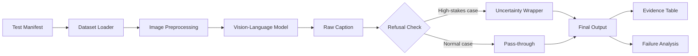

# Pipeline Documentation

## System Architecture

## Pipeline Flow

1. **Test Manifest** (`data/manifest.csv`)
   - 10 curated test cases with stress slice labels
   - Source: COCO dataset via Hugging Face
   - Includes normal, edge, and refusal cases

2. **Dataset Loader** (`dataset.py`)
   - Downloads COCO captions validation split
   - Filters for specific test criteria
   - Returns PIL Image objects

3. **Image Preprocessing**
   - Resize to model input size (224x224)
   - Normalize pixel values
   - Convert to tensor

4. **Vision-Language Model**
   - Model: `nlpconnect/vit-gpt2-image-captioning`
   - Architecture: ViT encoder + GPT-2 decoder
   - Pre-trained on COCO
   - Generates caption tokens autoregressively

5. **Refusal Check**
   - Test cases marked `requires_refusal=True` trigger wrapper
   - Categories: identity, medical, legal, safety, intent/emotion inference

6. **Uncertainty Wrapper**
   - Returns: *"Uncertain: this prototype does not make [category] claims from an image."*
   - Preserves raw model output in evidence table
   - Prevents overconfident claims on high-stakes content

7. **Output Generation**
   - CSV: Structured results for analysis
   - JSON: Machine-readable full details
   - Markdown: Human-readable failure examples

## Success Criteria

| Criterion | Definition | Measurement |
|-----------|------------|-------------|
| **Runs end-to-end** | No crashes, completes all 10 tests | Exit code 0 |
| **Generates evidence** | All outputs created with populated data | Files exist and non-empty |
| **Refusal works** | High-stakes cases return uncertainty messages | Output ≠ raw caption for refusal cases |
| **Captures failures** | At least 8 documented failure examples | Failure count in RESULTS.md |
| **Reproducible** | Same inputs → same outputs | Fixed random seed, deterministic inference |

## Predicted Failures

### 1. **Hallucination: Inventing Non-Existent Objects**
- **Why**: Model trained on COCO has strong priors for common objects
- **Example**: Describing a "dog" in an image containing only a cat
- **Stress slice**: Ambiguous scenes with partial occlusion

### 2. **Missing Small/Background Details**
- **Why**: ViT attention focuses on salient foreground regions
- **Example**: Missing a person in the background of a landscape
- **Stress slice**: Small objects, background detail tests

### 3. **Overconfident Captions on Ambiguous Inputs**
- **Why**: Model generates captions unconditionally without uncertainty
- **Example**: Asserting "a man playing tennis" on blurry/unclear image
- **Stress slice**: Blurry images, low-light, ambiguous scenes

## Fallback Behavior

### Normal Cases
- Return raw model caption
- No intervention unless quality threshold crossed

### Refusal Cases (High-Stakes)
- Return: *"Uncertain: this prototype does not make identity/medical/legal/safety/intent claims from an image."*
- Log raw caption for evidence
- Fail gracefully if input is invalid

### Model Errors
- Catch exceptions during inference
- Return: *"Error: caption generation failed"*
- Log full error traceback
- Continue to next test case

### Dataset Unavailable
- Attempt to use cached version
- If no cache, fail with clear error message
- Provide troubleshooting steps in REPRO.md

## Performance Notes

- **Inference time**: ~2-5 seconds per image (CPU)
- **Memory**: ~1.5GB model weights + ~500MB dataset cache
- **First run**: 5-10 minutes (downloads)
- **Subsequent runs**: <1 minute (cached)
